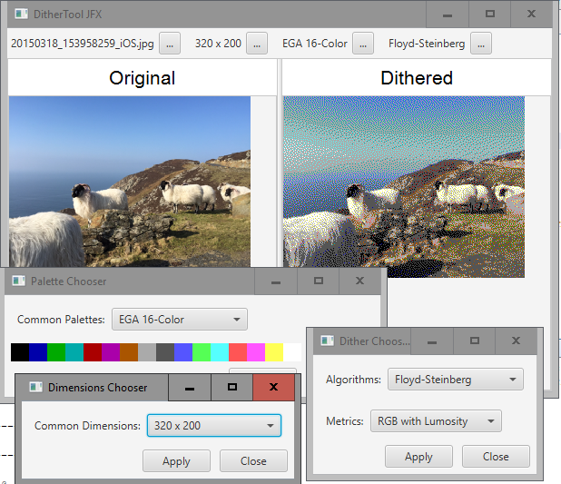
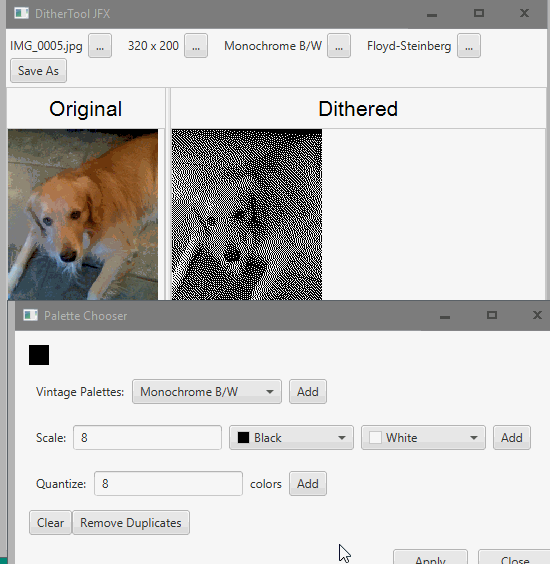

# Dithering Library/Tool

This is a tool to play with different error-diffusing dither algorithms,
which doubles as a learning exercise to understand JavaFX gui development
better.

There are two projects in this repo: the non-gui dithering library, and the gui driver tool itself.

A while back I had made a command-line Go program, cgaify (also [on github][1]), which
would do a Floyd-Steinberg dither to old-school palettes, because Floyd-Steinberg is
built into the Go standard packages.  For this interactive Java verison, I implemented 
several error-diffusion dithering algorithms, and a couple Color distance metrics, and more
palettes.  Not to mention, it's just a lot more fun to use interactively, with a side-by-side 
display of the product with the original.

Here's a screenshot:

... and here's an example of using the quantizer (added 2016-10-05) to get a good set 
of colors to use:

[1]: https://github.com/rwtodd/cgaify
